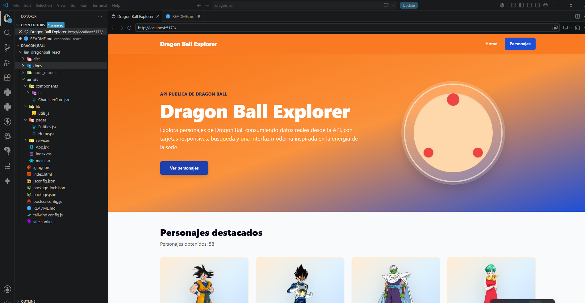
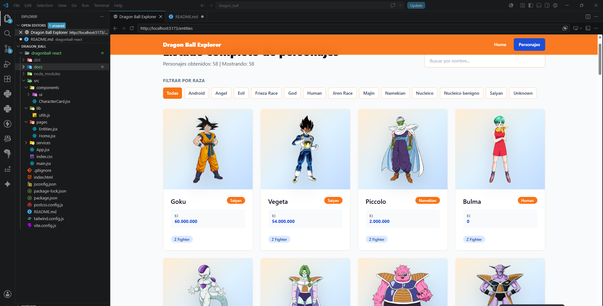
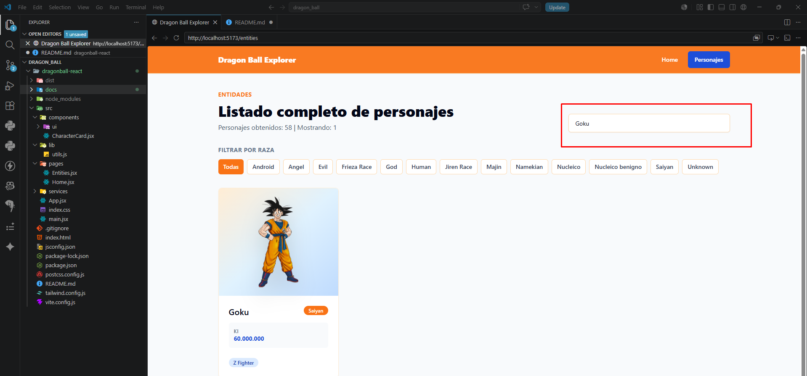

# Dragon Ball Explorer

Aplicacion React creada con Vite para consumir la API publica de Dragon Ball.

## Tecnologias

- React + Vite
- React Router DOM
- Axios
- Shadcn UI
- Tailwind CSS

## Instalacion

```bash
cd dragonball-react  
npm install
npm run dev
```

La app consume los personajes desde:

```txt
https://dragonball-api.com/api/characters
```

El servicio retorna los datos desde `response.data.items`.


#### EVIDENCIAS MOSTRADAS DE LA WEB DE DRAGON BALL CONSUMIENDO APIS:

##### PAGINA HOME:



##### PERSONAJE:




##### BUSCADOR




